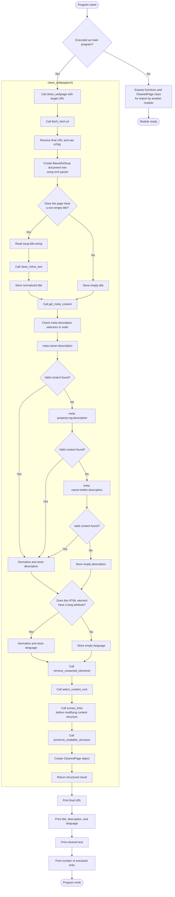
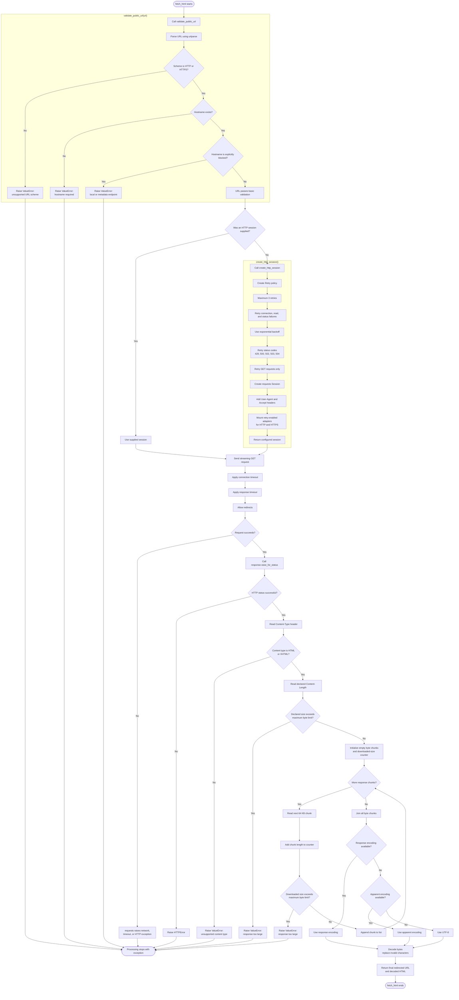
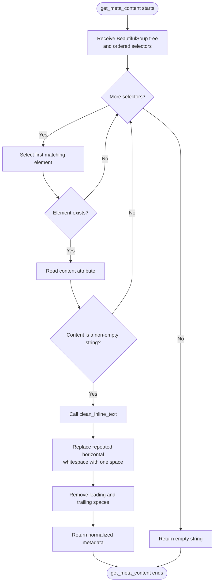
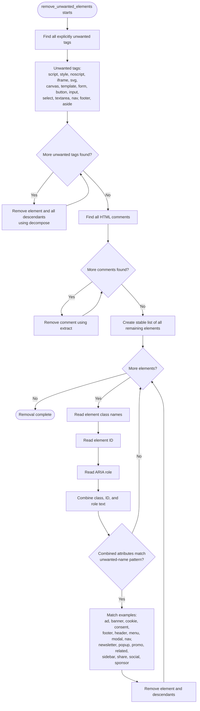
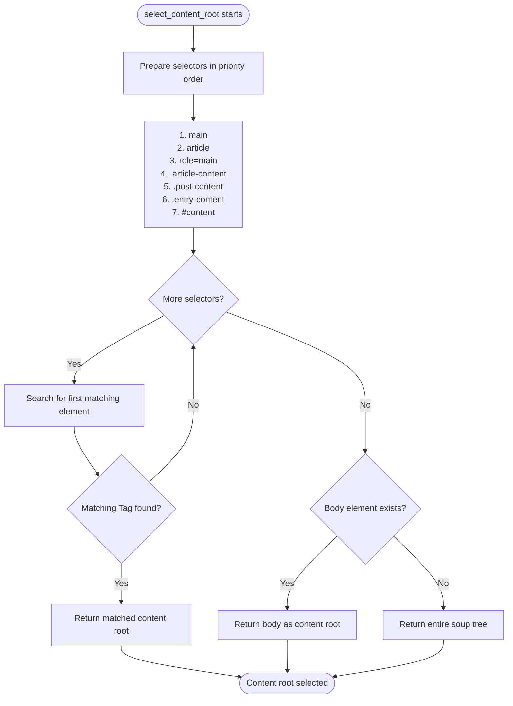
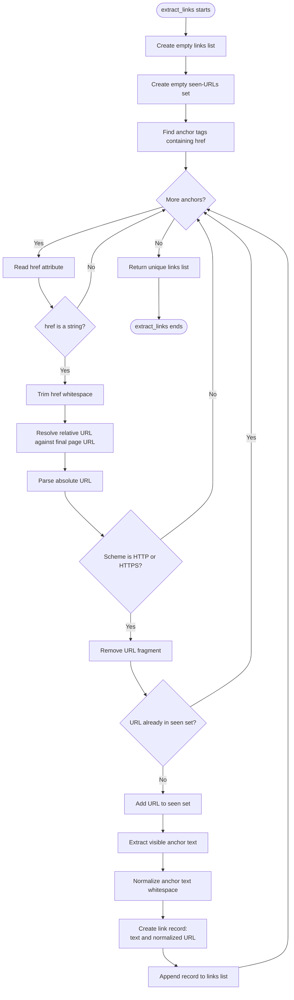
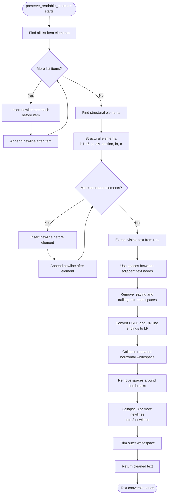
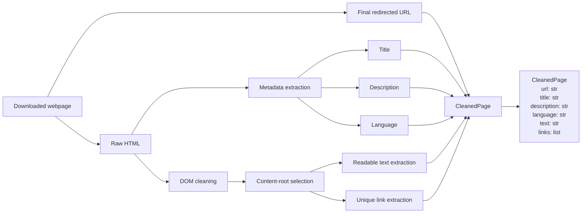
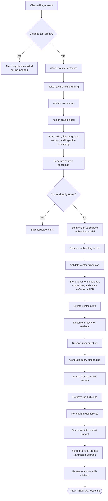

# Complete Webpage Cleaning Flowchart



# HTTP Fetching Flow



# HTML Metadata Extraction Flow



# Unwanted Element Removal Flow



# Main Content Selection Flow



# Link Extraction Flow



# Readable Text Conversion Flow



# Structured Output Flow



# End-to-End Data Transformation

```text
Input URL
   |
   v
Basic URL validation
   |
   v
Retry-enabled HTTP session
   |
   v
Streaming HTML download
   |
   +-- Reject HTTP errors
   +-- Reject non-HTML responses
   +-- Reject oversized responses
   |
   v
Decode response bytes
   |
   v
Parse HTML into BeautifulSoup DOM
   |
   +-- Extract title
   +-- Extract description
   +-- Extract language
   |
   v
Remove unwanted content
   |
   +-- Scripts and styles
   +-- Forms and controls
   +-- Navigation and footers
   +-- Advertisements and popups
   +-- Cookie and consent elements
   +-- HTML comments
   |
   v
Select main content container
   |
   +-- <main>
   +-- <article>
   +-- role="main"
   +-- Common article-content classes
   +-- <body> fallback
   |
   +----------------------+
   |                      |
   v                      v
Extract links         Convert DOM to text
   |                      |
   +-- Resolve URLs        +-- Preserve headings
   +-- Remove fragments   +-- Preserve paragraphs
   +-- Remove duplicates  +-- Preserve list markers
   +-- Keep HTTP(S) only  +-- Normalize whitespace
   |                      |
   +-----------+----------+
               |
               v
        Create CleanedPage
               |
               v
     Cleaned text ready for:
       chunking -> embeddings
       -> CockroachDB storage
       -> RAG retrieval
```

# Failure Paths

| Stage | Failure condition | Result |
|---|---|---|
| URL validation | Scheme is not HTTP or HTTPS | `ValueError` |
| URL validation | Hostname is missing | `ValueError` |
| URL validation | Explicitly blocked hostname | `ValueError` |
| HTTP connection | DNS, connection, or timeout failure | `requests` exception after retries |
| HTTP response | 4xx or unrecoverable 5xx status | `HTTPError` |
| Content validation | Response is not HTML/XHTML | `ValueError` |
| Size validation | Declared response exceeds limit | `ValueError` |
| Streaming validation | Actual downloaded data exceeds limit | `ValueError` |
| Parsing | Malformed HTML | `lxml` attempts recovery |
| Metadata | Metadata is absent | Empty string |
| Main-content selection | No semantic content container | Falls back to `<body>` or complete DOM |
| Links | Invalid, duplicate, or non-HTTP link | Link is skipped |

# RAG Pipeline Extension


